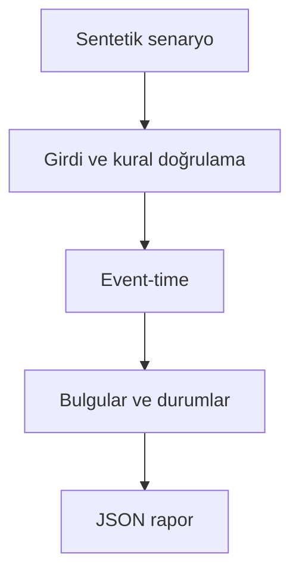

# Mimari

Sırasız CDC olaylarından doğru tarihsel müşteri görünümünü atomik olarak oluşturmak.

Asıl alan akışı: **raw ingestion → dedup → highest sequence → half-open history → as_of**. CLI JSON yükler, çekirdek `run(config)` alan motorunu çağırır ve JSON seri hale getirir. Veritabanı kullanan örnekler geçici dizinde izole edilir; kalıcı sınıflar doğrudan çağrılırken dosya yolu dışarıdan verilir.

## İnvariant ve başarısızlık sınırı

Aynı zamanda en yüksek source_seq kazanır; valid_from dahil valid_to hariçtir.

Etkilenen anahtarın tüm tarihçesi yeniden kurulur; büyük hacimde bölümleme ve artımlı SQL gerekir.

Her hata kararı makine tarafından okunabilir çıktı veya açık exception üretir. Geçersiz yapılandırma sessizce düzeltilmez. Olası tekrarların güvenliği ilgili çekirdeğin kabul kurallarına bağlıdır; bütün projelere ortak bir retry uygulanmaz.
